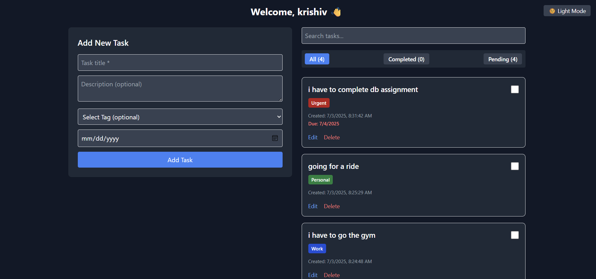
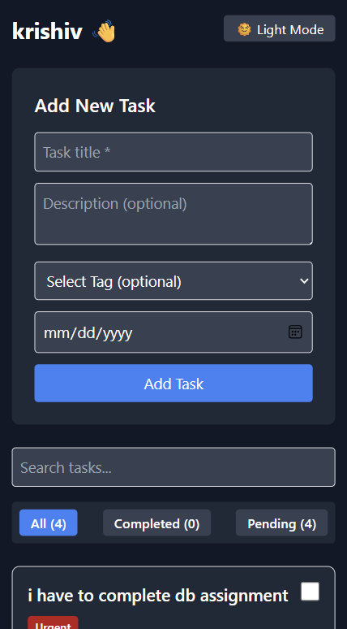

# Personal Task Tracker

## 📖 Description
A sleek and responsive personal task management app built with React and Tailwind CSS. This app allows users to easily create, manage, filter, and edit tasks. It includes essential task management functionality along with bonus features like tagging, due dates, dark mode, and search — all persisted in localStorage without any backend.

---

## 🚀 Features

### ✅ Core Features
- 🔐 Simple login with localStorage username
- 📝 Create, edit, delete tasks
- ✅ Mark tasks as completed/pending
- 📆 Displays creation and due dates
- 🧠 Visual distinction between task status
- 🔍 Filter tasks by status (All, Completed, Pending)
- 💾 Data persistence using localStorage

### ✨ Bonus Features
- 🏷 Task tags: Work, Personal, Urgent
- 📅 Due dates with overdue indicator
- 🌙 Dark mode toggle
- 🔎 Real-time task search
- 🎯 Fully responsive for mobile & desktop


## 🧰Technologies Used 

⚛️ React.js (Vite)
🎨 Tailwind CSS
🌗 Dark Mode via localStorage & system preference
🗂 localStorage for persistent state
---

## 🛠 Setup Instructions

1. Clone the repository:
   ```bash
   git clone https://github.com/your-username/personal-task-tracker.git

   Install dependencies:

2. Install dependencies:
npm install
Start the development server:

3. Start the development server:
npm run dev

4. Open the app in your browser:
http://localhost:5173


## 🖼 Screenshots

| Desktop View | Mobile View |
|--------------|-------------|
|  |  |
